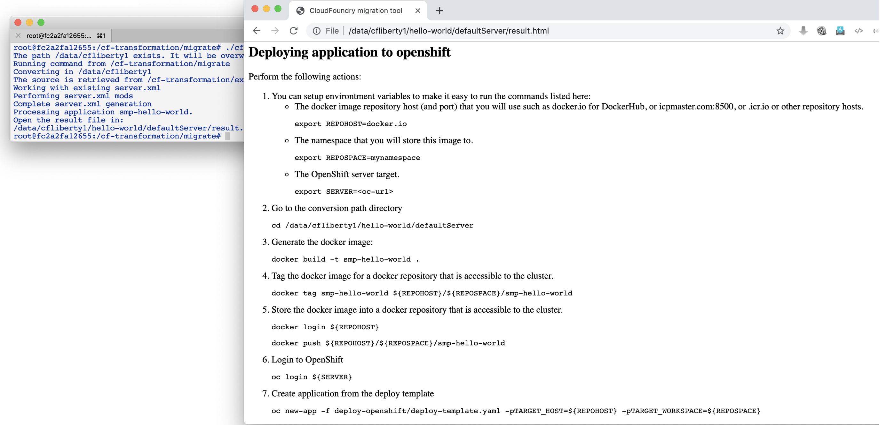

# CF Migration tool

This tool assists you in migrating CloudFoundry application to Kubernetes based platform.

## The approach

The tool is not supposed to run for building the application. The tool builds all the necessary assets that allows you to deploy in Kubernetes environment. The generated assets from this tool can be used to test and deploy the application and then assists you to create an automated DevOps pipeline. The tool is only meant to be run once, as long as the application is not changed significantly.

The approach that we take is meant to help you transition into a full Kubernetes developer instead of a tool that automate you to build a Kubernetes application from a CloudFoundry application source. The resulting assets are typically:

- Configuration files for the application code
- Dockerfile to generate the image
- YAML configuration files to deploy to Kubernetes

If you are interested in the concepts behind the migration from CloudFoundry to Kubernetes, see [Migration](migration.md).

## The tool

The tool is packaged as a GitHub repository in https://github.com/ibm-cloud-architecture/cf-transformation. Sample applications are provided in the exemplar directory. This tool requires the following pre-requisites:

- bash
- jq
- git
- curl
- xmlstarlet
- maven or gradle

You can run this tool using a Docker container, see [docker](docker.md).

To run the tool, perform the following:

1. Download the tool from GitHub:

		git clone https://github.com/ibm-cloud-architecture/cf-transformation

2. Change the directory to the migrate sub-directory:

		cd cf-transformation/migrate

3. Get the content of your application VCAP_SERVICES from Cloud Foundry:

		cf env <appname> | awk '/VCAP_SERVICES/{flag=1;next} /VCAP_APPLICATION/{flag=0} flag' | sed  -e '$d' | sed -e '$d' | sed -e ‘$d’ > vcap.json

3. Run the migration tool against your source:

		./cf-migrate.sh -s <source> -t <tempdir> -b <app type> -e <target type>

	Where:

	- `-s` source path or source git repository URL
	- `-t` the temporary conversion directory where the work and output will be performed (default: /tmp/convdir)
	- `-b` the application type (buildpack) ibm-websphere-liberty, java, nodejs etc
	- `-e` target environment: openshift, iks or icp

To be able to successfully perform the rest of the migration, you will need:

- docker
- kubectl and CLI access to the kubernetes environment
- Access to the cloud Foundry environment

## The output

The tool run is shown in:

It mainly produces an HTML file that you can view for deploying your application to Kubernetes:

You can run the commands listed in the result.html to deploy your application to Kubernetes.

The following are specific output and recommendation for different application types (Buildpacks):

- [ibm-websphere-liberty](docs/liberty.md)
- [nodejs](docs/nodejs.md)
- [java springboot](docs/java.md)
