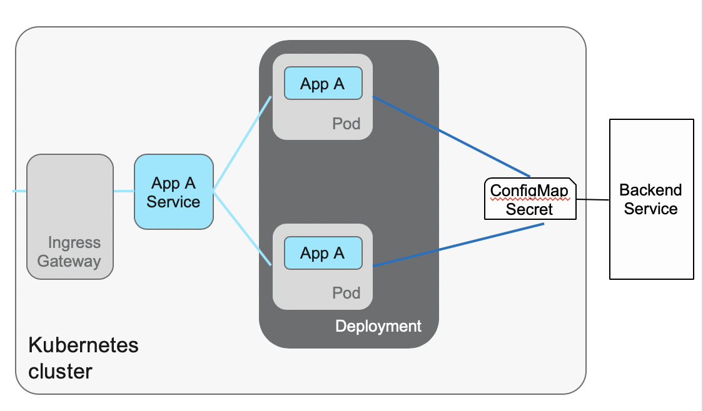

# CF to Kubernetes migration tool
---
## Migration concepts

- Provide a Cloud Foundry application developer to quickly able to migrate and deploy on to a Kubernetes environment, be it an OpenShift or IBM Cloud Private environment
- Minimize learning curve needed to deploy and develop application on a new platform
- Pre-requisites:
	- Known application type (known buildpack)
	- Known service bindings 
	- Manifest file 

---
## CloudFoundry application architecture

---

## Kubernetes application architecture

---

## Application Staging process 
@snap[west span-50]
### CloudFoundry
All the following are performed by cf push
@ul
- The CLI uploads application artifacts to CloudFoundry
- CloudFoundry selects the appropriate BuildPack
- BuildPack prepares the artifacts to create a runnable unit (Droplet)
- CloudFoundry stores the Droplet in the Blob store
- CloudFoundry deploys the Droplet into its Runtime as a Garden Container and provides VCAP_SERVICES to access backend services
- CloudFoundry associates the appropriate Router entry
@ulend
@snapend

@snap[east span-50]
### Kubernetes
@ul
- Build and assemble the necessary deployment artifacts
- Create a docker image using a Dockerfile and store the image in a Docker repositorydocker build …docker push …
- Create ConfigMap and Secrets to access backend services
- Use deployment YAML to deploy docker image into a Kubernetes Pod in a Deployment or DeploymentConfigkubectl apply -f …
- Use the Service YAML to associate the pods to a Kubernetes Service and optionally define it to an Ingress Gateway or OpenShift Routekubectl apply -f …
@ulend
@snapend

---

## Migration approach

---

## Migration scripts

---

## Migration tool prerequisites

---

## Running migration tool

---

## Sample output
