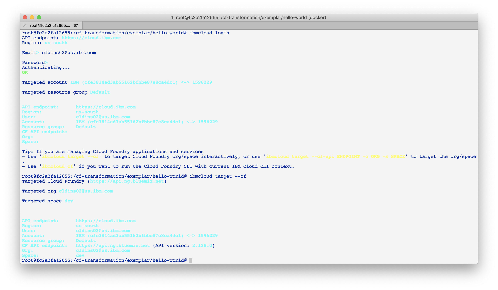
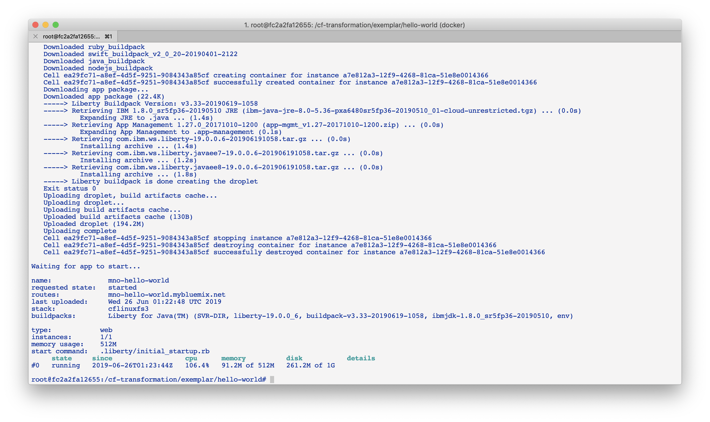

# Migrating a CloudFoundry application 

The exercise here is divided into the following sections:

- Liberty application from exemplar
- Running Liberty hello world application from GIT
- Running NodeJS application 
- Running a War file using Java buildpack
- Running a Springboot jar file

## Running Sample liberty application

Perform the following steps:

1. Run the provided docker image (you should have Docker running in your environment, and provide a local path that is empty that will be used for working area)

		docker run -v <your_local_path>:/data -v /var/run/docker.sock:/var/run/docker.sock -it ibmcloudacademy/cfmigrationtool bash

2. From the bash shell of the docker environment, clone the migration code:

		git clone https://github.com/ibm-cloud-architecture/cf-transformation

3. Go to the example code directory:

		cd cf-transformation/exemplar/hello-world
	

4. Login and deploy the cloud foundry application to IBM Cloud environment:
 
	- you will be prompted additional informations for login 
	- you may substitute your name for the User Provided Service values
	- change the `abc` for the `push` command with your initials, the complete string must be unique.

			ibmcloud login 
			ibmcloud target --cf

	

			mvn clean install
        	        ibmcloud cf cups ups1 -p '{ "key1": "First " }'
		      	ibmcloud cf cups ups2 -p '{ "key2": "Lastname" }'
			ibmcloud cf cups ups3 -p '{ "key3": "value3" }'
			ibmcloud app push abc-hello-world -n abc-hello-world

	

5. Test the application on whether it is running, go to the URL `https://abc-hello-world.mybluemix.net` and you should get the following screen:   

6. Now that the application is running, you should be able to get the values of the custom ups in the application page.

8. Go to the migration tool path:

		cd /cf-transformation/migrate

7. Retrieve the application's VCAP_SERVICES variable

		cf env abc-hello-world | awk '/VCAP_SERVICES/{flag=1;next} /VCAP_APPLICATION/{flag=0} flag' | sed  -e '$d' | sed -e '$d' | sed -e ‘$d’ > vcap.json
		cat vcap.json

9. Run the migration command:

		./cf-migrate.sh -s /cf-transformation/exemplar/hello-world -t /data/cfliberty1 -e openshift -b ibm-websphere-liberty

	The output should be similar to the following, open the resulting file using a Web browser (remember the path mapping that you did in step 1).

10. Go directly to the section of migration and perform the step-by-step instruction there. Note that you must specify the following values:

	- Repository host, you can use `docker.io` to use DockerHub
	- Namespace, your own namespace in DockerHub (similar to your userID)
	- Openshift cluster host

	Note that for login to OpenShift cluster using `oc login` command, you may be asked to get a login token from the server.

11. Once the migration is completed, check the route that is created and open a browser window to `https://<routehost>/JavaHelloWorldApp`. The result should be similar to the one you have for CloudFoundry in step 5. 

## Working with sample Liberty app from GIT

1. Go back to the `migrate` directory and run the following command:

		cd /cf-transformation/migrate
		./cf-migrate.sh -s https://github.com/IBM-Cloud/java-helloworld -t /data/cfliberty2 -e openshift -b ibm-websphere-liberty

2. Open the `result.html` that was presented in a Web browser and follow the instruction similar to the first section. Check whether the application launched and can be accessed. Check the URL `https://<routehost>/JavaHelloWorldApp`.

## Working with Springboot application with a JAR file

1. Go back to the `migrate` directory and run the following command:

		cd /cf-transformation/migrate
		./cf-migrate.sh -s https://github.com/ibm-cloud-academy/lightblue-web -t /data/cfjava -e openshift -b java

2. Open the `result.html` that was presented in a Web browser and follow the instruction similar to the first section. Check whether the application launched and can be accessed. Check the URL `https://<routehost>/customer`.

## Working with nodejs application

1. Go back to the `migrate` directory and run the following command:

		cd /cf-transformation/migrate
		./cf-migrate.sh -s https://github.com/IBM-Cloud/node-helloworld -t /data/cfnodejs -e openshift -b nodejs

2. Open the `result.html` that was presented in a Web browser and follow the instruction similar to the first section. Check whether the application launched and can be accessed. Check the URL `https://<routehost>/`.

