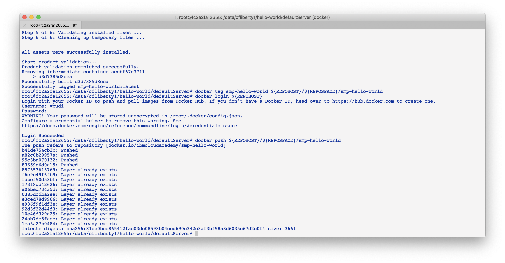
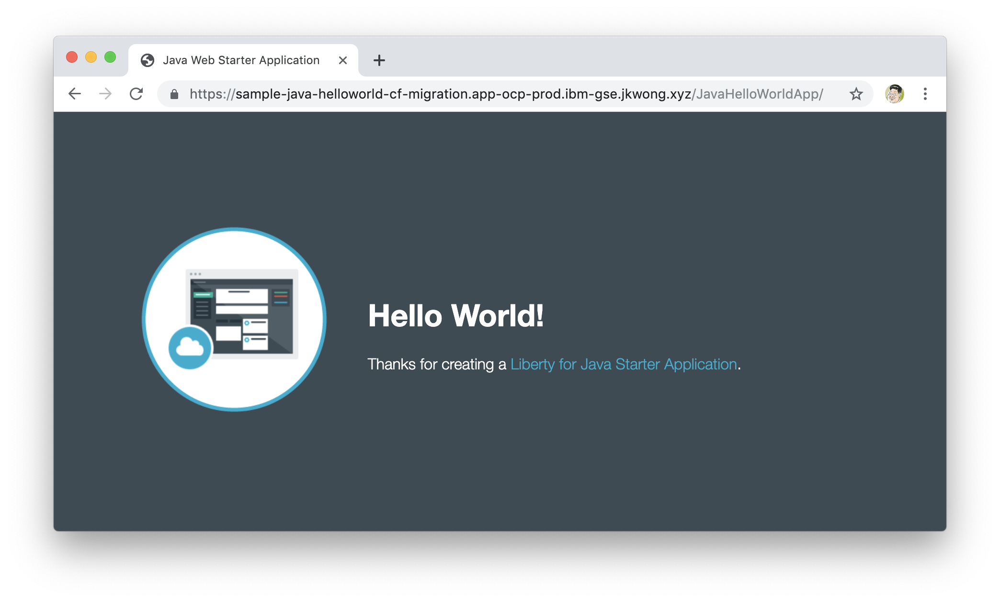
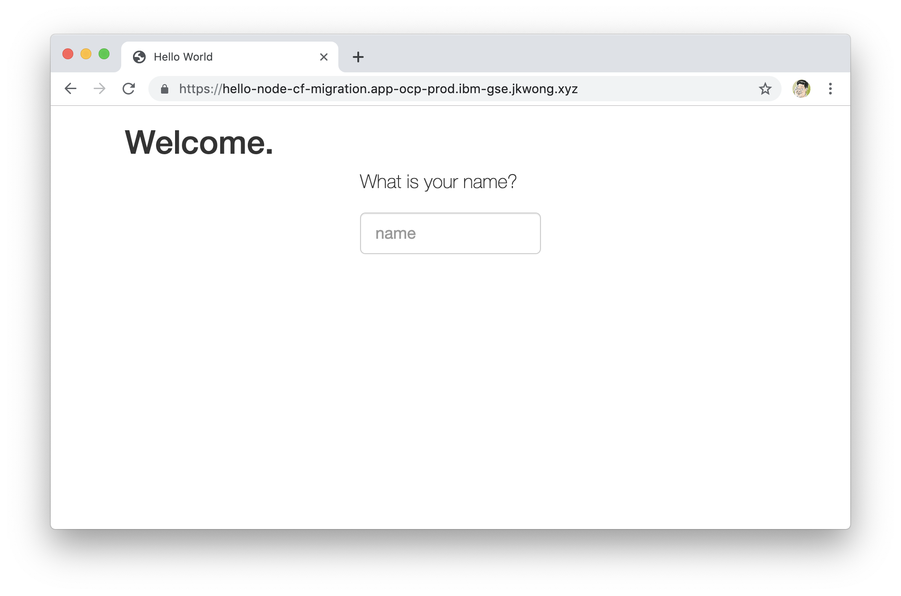

# Migrating Cloud Foundry applications to IBM Kubernetes Services

This exercise guides you through using the migration tool for the following example applications:

- Liberty hello-world application accessed from the downloaded `exemplar` sub-directory
- Liberty hello-world application accessed from a Git repository
- SpringBoot application (jar file) accessed from a Git repository
- Node.js application accessed from a Git repository 

The migration tool is run from the provided Docker container.

## Liberty hello-world application accessed from downloaded `exemplar` sub-directory

Perform the following steps:

1. Run the provided docker image. You should have Docker installed and running on your system. Provide a local directory path that is empty to be used as the conversion working directory. This command connects you to a bash shell inside the migration tool container.

		docker run -v <your_local_path>:/data -v /var/run/docker.sock:/var/run/docker.sock -it ibmcloudacademy/cfmigrationtool bash

2. From the bash shell of the docker container, clone the migration tool and sample application code:

		git clone https://github.com/ibm-cloud-architecture/cf-transformation

3. Go to the example application code directory:

		cd cf-transformation/exemplar/hello-world
	

4. Login and deploy the application to Cloud Foundry in IBM Cloud Public:
 
	- You will be prompted for your user id, password, and region for login 
	- You should substitute your first and last name for the User Provided Service values
	- Substitute your initials for the `abc` in the `ibmcloud app push` command. Your application name and route must be unique.

			ibmcloud login 
			ibmcloud target --cf

	

		mvn clean install
		ibmcloud cf cups ups1 -p '{ "key1": "First " }'
		ibmcloud cf cups ups2 -p '{ "key2": "Lastname" }'
		ibmcloud cf cups ups3 -p '{ "key3": "value3" }'
		ibmcloud app push abc-hello-world -n abc-hello-world

	
	

5. Test your application to see whether it is running on Cloud Foundry. Go to the URL `http://abc-hello-world.mybluemix.net`, substituting your initials for `abc`. You should see the following screen, with your name displayed:   

6. Now that the application is running, you should see that it is getting the values for your first and last name from the Custom User Provided Services (cups) you created and populated in the previous commands.

8. Go to the migration tool path:

		cd /cf-transformation/migrate

7. Retrieve the application's VCAP_SERVICES variables and put them in the `vcap.json` file.

		ibmcloud cf env abc-hello-world | awk '/VCAP_SERVICES/{flag=1} /^}/{flag=0} flag' | sed 's/"VCAP_SERVICES"://' > vcap.json
		cat vcap.json

9. Run the migration command:

		./cf-migrate.sh -s /cf-transformation/exemplar/hello-world -t /data/cfliberty1 -e iks -b ibm-websphere-liberty

	The output should be similar to the following: 

10. Open the generated `result.html` file using a Web browser (remember the path mapping that you did in step 1). The `result.html` file will be in the subdirectory `cfliberty1/hello-world/defaultServer`. 

10. Go directly to the section **Deploying application to IBM Kubernetes Services** and perform the step-by-step instructions there. Note that you must specify the following values:

	- Repository host (REPOHOST). You can use `docker.io` to use DockerHub
	- Namespace (REPOSPACE). Your own namespace in DockerHub (similar to your userID)
	- IBM Kubernetes Services cluster name (CLUSTER)

	Note that for login to the IBM Cloud public using `ibmcloud login` may require a pre-set SSO token. You can get this token from your IBM Cloud Public Web UI.

	
	
	

11. Depending on the cluster type that you are having (a free or paid cluster), you have 2 options to get to the application, once through the NodePort and the other is through the Ingress gateway.

	- Working with a NodePort, you must find the worker node's Public IP address and the mapped NodePort.
	- To get the worker node Public IP, use the command: `ibmcloud ks workers` and to get the NodePort use the command: `kubectl get service`
	- Working with the Ingress gateway, you must find out the ingress hostname, which is in the form of `<appname>.<clusterName>.<region>.appdomain.cloud`
	- The routehost can be constructed by either `<workerPublicIP>:<nodePort>` or `<ingressHostname>`

11. Once the migration is completed, check the route that is created and open a browser window to `https://<routehost>/JavaHelloWorldApp`. The result should be similar to the one you had for Cloud Foundry in step 5. 

## Liberty hello-world application accessed from a Git repository

1. Go back to the `migrate` directory and run the following command:

		cd /cf-transformation/migrate
		./cf-migrate.sh -s https://github.com/IBM-Cloud/java-helloworld -t /data/cfliberty2 -e iks -b ibm-websphere-liberty

2. Open the `result.html` file in subdirectory `cfliberty2/hello-world/defaultServer` in a Web browser and follow the instructions similar to the first section. Check whether the application launched and can be accessed. Check the URL `https://<routehost>/JavaHelloWorldApp`. 

## SpringBoot application (jar file) accessed from a Git repository

1. Go back to the `migrate` directory and run the following command:

		cd /cf-transformation/migrate
		./cf-migrate.sh -s https://github.com/ibm-cloud-academy/lightblue-customer -t /data/cfjava -e iks -b java

2. Open the `result.html` file in subdirectory `cfjava/target` in a Web browser and follow the instructions similar to the first section. Check whether the application launched and can be accessed. Check the URL `https://<routehost>/customer`.  

## Node.js application accessed from a Git repository

1. Go back to the `migrate` directory and run the following command:

		cd /cf-transformation/migrate
		./cf-migrate.sh -s https://github.com/IBM-Cloud/node-helloworld -t /data/cfnodejs -e iks -b nodejs

2. Open the `result.html` file in subdirectory `cfnodejs/node-helloworld`in a Web browser and follow the instructions similar to the first section. Check whether the application launched and can be accessed. Check the URL `https://<routehost>/`. 

