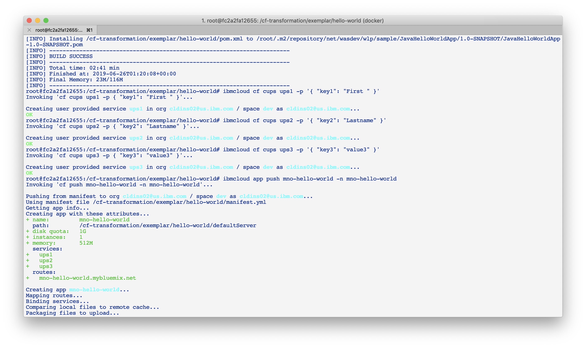
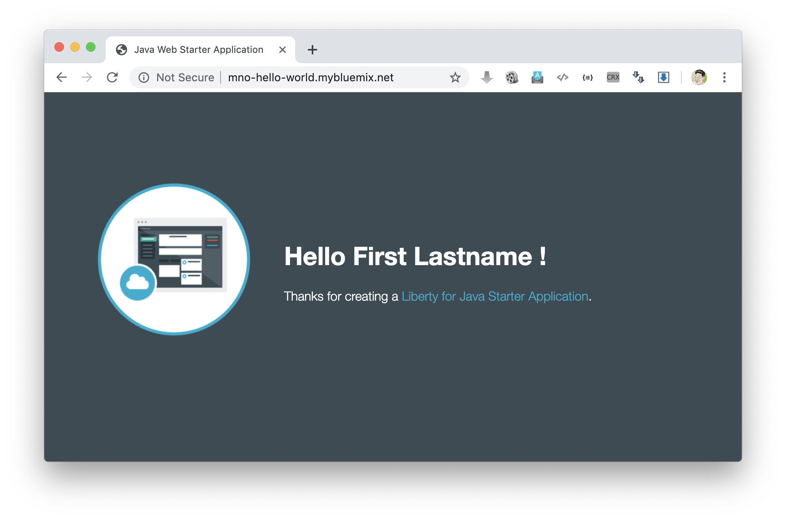
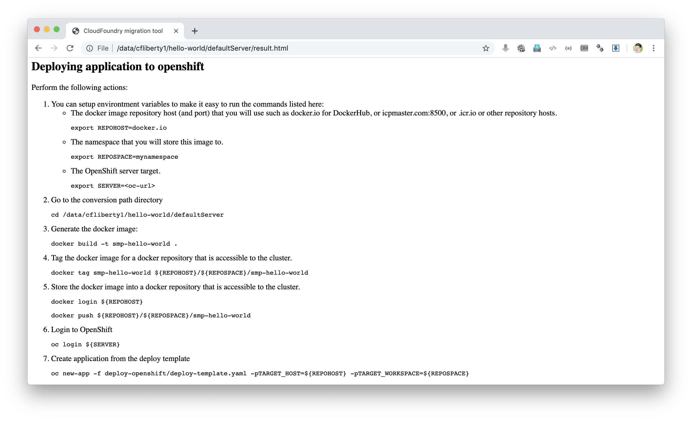
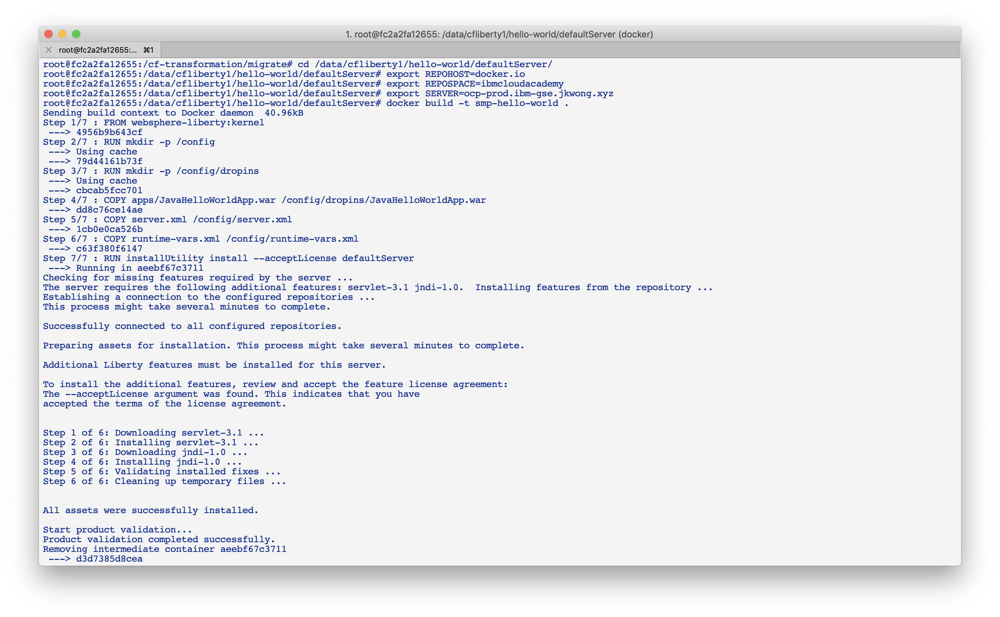
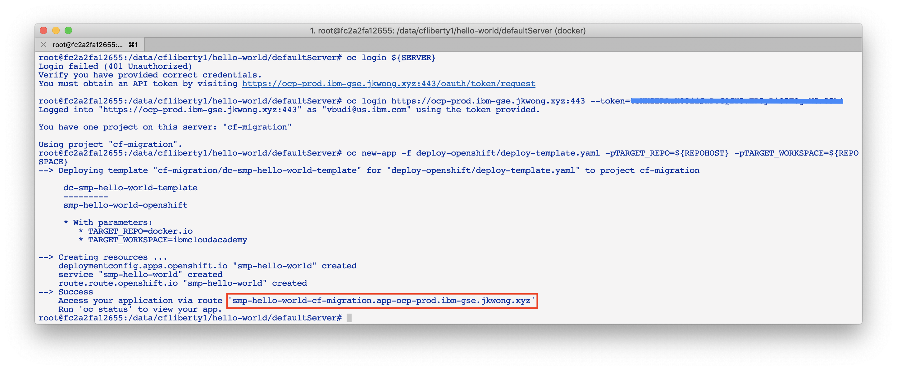
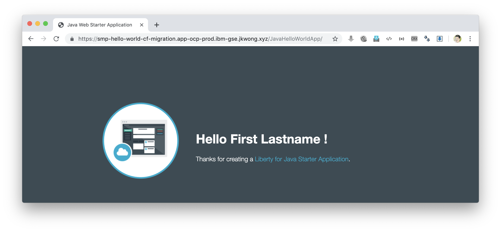
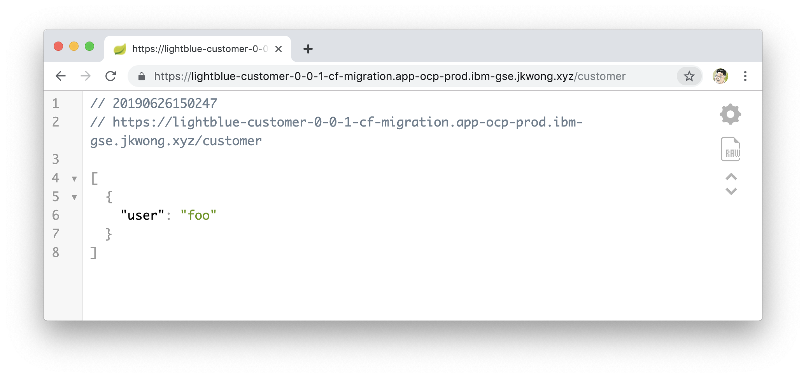
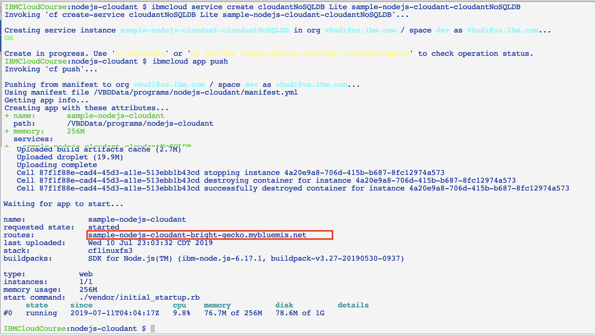
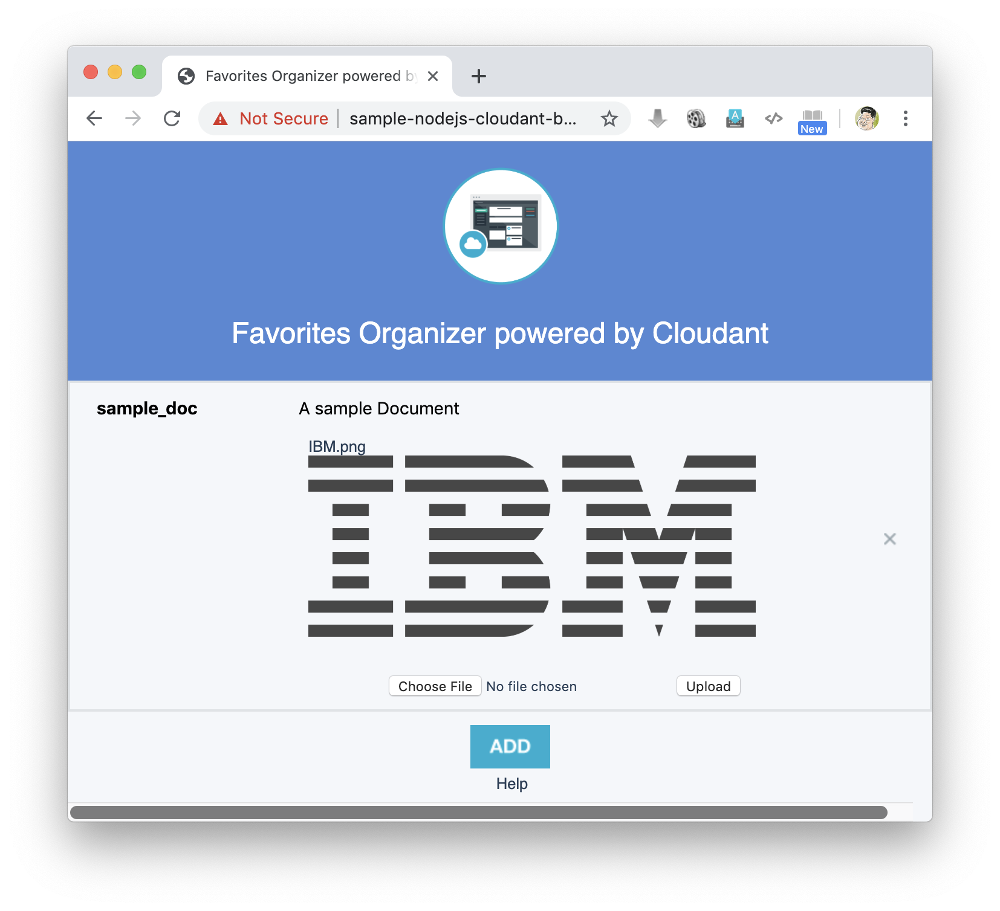

# Migrating Cloud Foundry applications to OpenShift

This exercise describes using the migration tool to migrate each of the following example applications to OpenShift:

- Liberty hello-world application accessed from downloaded `exemplar` sub-directory
- Liberty hello-world application accessed from a Git repository
- SpringBoot application (jar file) accessed from a Git repository
- Node.js application accessed from a Git repository
- Node.js application with a Cloudant database backend service

The migration tool is run from a Docker container. The migration tool Docker container is provided so you can run the tool without having to install all the prerequisite software on your own system.

In the beginning of the exercise, you deploy the application to a CloudFoundry platform. The instructions use the IBM Cloud Public Cloud Foundry platform for convenience, but the tool is designed to work with Pivotal or any other Cloud Foundry platform.

The applications are deployed to Cloud Foundry for two purposes: 

- To validate that the application **does** run in CloudFoundry
- To extract the credentials for any backend services used by the Cloud Foundry application in the VCAP_SERVICES environment variable. As part of the migration, these credentials are used to create Kubernetes secrets, to allow the same backend services to be accessed by the application running on the target Kubernetes platform (OpenShift, IBM Kubernetes Service, or IBM Cloud Public).

You should be able to use any application that can be deployed to Cloud Foundry to do these exercises. By running through the steps with the example applications provided here, you will acquire the skills to use the tool with other applications running on Cloud Foundry.

## Liberty hello-world application accessed from downloaded `exemplar` sub-directory

In this first case, you migrate an application that runs on WebSphere Liberty in Cloud Foundry. This application has a dependency on several custom user-provided services. The migration task is divided into several stages which are listed below.

### Preparing the migration environment

You run these preparation steps only once. There is no need to redo these steps for subsequent lab exercises: 

1. Run the provided docker image. You should have Docker installed and running on your system. Provide an empty local directory path to be used as the conversion working directory. The following command connects you to a bash shell inside the migration tool container. 

		docker run -v <your_local_path>:/data -v /var/run/docker.sock:/var/run/docker.sock -it ibmcloudacademy/cfmigrationtool bash

2. From the bash shell of the docker container, clone the repository containing the migration tool and sample application code:

		git clone https://github.com/ibm-cloud-architecture/cf-transformation

	The result is that you have a `/cf-transformation` directory that contains the conversion code.

### Testing the application on the Cloud Foundry environment

As mentioned at the beginning of the exercise, you deploy the application to Cloud Foundry. This stage verifies that the application is valid and allows you to collect the proper VCAP_SERVICES environment variable for the application. The binding of backend services to the application in Cloud Foundry is typically performed by referencing the VCAP_SERVICES variable.

1. Go to the example application code directory:

		cd cf-transformation/exemplar/hello-world
	

2. Login and deploy the application to Cloud Foundry in IBM Cloud Public. 
 
	- You will be prompted for your user id, password, and region for login 
	- You should substitute your first and last name for the User Provided Service values
	- Substitute your initials for the `abc` in the `ibmcloud app push` command. Your application name and route must be unique.

			ibmcloud login 
			ibmcloud target --cf

	

		mvn clean install
		ibmcloud cf cups ups1 -p '{ "key1": "First " }'
		ibmcloud cf cups ups2 -p '{ "key2": "Lastname" }'
		ibmcloud cf cups ups3 -p '{ "key3": "value3" }'
		ibmcloud app push abc-hello-world -n abc-hello-world

	
	

3. Test your application to see whether it is running on Cloud Foundry. Go to the URL `http://abc-hello-world.mybluemix.net`, substituting your initials for `abc`. You should see the following screen, with your name displayed:   

4. Now that the application is running, you should see that it is getting the values for your first and last name from the Custom User Provided Services (cups) you created and populated in the previous commands.

5. Go to the migration tool path:

		cd /cf-transformation/migrate

6. Retrieve the application's VCAP_SERVICES variables and put them in the `vcap.json` file.

		ibmcloud cf env abc-hello-world | awk '/VCAP_SERVICES/{flag=1} /^}/{flag=0} flag' | sed 's/"VCAP_SERVICES"://' > vcap.json
		cat vcap.json

### Running the migration tool and deploying the application to OpenShift

The last stage of the migration is performed for the specific target environment. 

1. Run the migration command:

		./cf-migrate.sh -s /cf-transformation/exemplar/hello-world -t /data/cfliberty1 -e openshift -b ibm-websphere-liberty

	The output should be similar to the following: 

2. Open the generated `result.html` file using a Web browser (remember the path mapping that you did in the first step of preparing the environment). The `result.html` file will be in the subdirectory `cfliberty1/hello-world/defaultServer`. 

10. Go directly to the section **Deploying application to openshift** and perform the step-by-step instructions there. Note that you must specify the following values:

	- Repository host (REPOHOST). You can use `docker.io` to use DockerHub
	- Namespace (REPOSPACE). Your own namespace in DockerHub (similar to your userID)
	- Openshift cluster host URL (SERVER)

	Note that for login to the OpenShift cluster using the `oc login` command, you may be asked to get a login token from the server. You can easily get this token from a login session to the OpenShift Web Console GUI. The commands that are listed in steps 2 and later are using the environment variables that are set above. If you have defined these environment variables, you should be able to run the commands as-is, directly cut-and-pasted from the `result.html` browser page to the bash prompt of the cfmigrationtool container. 

	
	
	

4. Once the migration is completed, check the route that is created and open a browser window to `https://<routehost>/JavaHelloWorldApp`. The result should be similar to the one you had for the application on Cloud Foundry. 

## Liberty hello-world application accessed from a Git repository

In this second test case, you will migrate content that is retrieved directly from a git repository. This sample application does not use any backend services, hence you do not need to collect the VCAP_SERVICES values. The steps listed here can be performed directly similar to the previous exercise. 

1. Go back to the `migrate` directory and run the following command:

		cd /cf-transformation/migrate
		./cf-migrate.sh -s https://github.com/IBM-Cloud/java-helloworld -t /data/cfliberty2 -e openshift -b ibm-websphere-liberty

2. Open the `result.html` file in subdirectory `cfliberty2/hello-world/defaultServer` in a Web browser and follow the instructions similar to the first test case. Check whether the application has launched and can be accessed on OpenShift. Check the URL `https://<routehost>/JavaHelloWorldApp`. 

## SpringBoot application (jar file) accessed from a Git repository

In this third test case, you will migrate a SpringBoot REST application from a git repository. This sample application does not use any backend services, hence you do not need to collect the VCAP_SERVICES values. The steps listed here can be performed directly similar to the first exercise. 

1. Go back to the `migrate` directory and run the following command:

		cd /cf-transformation/migrate
		./cf-migrate.sh -s https://github.com/ibm-cloud-academy/lightblue-customer -t /data/cfjava -e openshift -b java

2. Open the `result.html` file in subdirectory `cfjava/target` in a Web browser and follow the instructions similar to the first test case. Check whether the application has launched and can be accessed on OpenShift. Check the URL `https://<routehost>/customer`.  

## Node.js application accessed from a Git repository

In this fourth test case, you will migrate a Node.js application from a git repository. This sample application does not use any backend services, hence you do not need to collect the VCAP_SERVICES values. The steps listed here can be performed directly similar to the first exercise. 

1. Go back to the `migrate` directory and run the following command:

		cd /cf-transformation/migrate
		./cf-migrate.sh -s https://github.com/IBM-Cloud/node-helloworld -t /data/cfnodejs -e openshift -b nodejs

2. Open the `result.html` file in subdirectory `cfnodejs/node-helloworld`in a Web browser and follow the instructions similar to the first test case. Check whether the application has launched and can be accessed on OpenShift. Check the URL `https://<routehost>/`. 

## Node.js application with a Cloudant database backend service
 
In this last test case, we demonstrate another example that uses a backend service. This sample application uses a Cloudant database. Therefore in this case you will deploy the application to Cloud Foundry first so you can collect the VCAP_SERVICES information.

1. Clone the application, and deploy the Cloudant database backend service and the application. Assuming you are still logged on to IBM Cloud Public, the following commands are used.

		git clone https://github.com/IBM-Cloud/nodejs-cloudant.git
		cd nodejs-cloudant
		ibmcloud service create cloudantNoSQLDB Lite sample-nodejs-cloudant-cloudantNoSQLDB
		ibmcloud service list
		
   Keep running the `ibmcloud service list` command until the `last operation` of the Cloudant service returns as `create succeeded`. Then continue with the following command.
		
		ibmcloud app push

 - The application and its Cloudant service will be deployed automatically. The route is shown at the end of the deployment.  
 - Open the application and try uploading any file from your local system to the organizer application. Use **Choose file** and then **Upload**. This action is needed to demonstrate that the migrated application is using the same Cloudant backend service from OpenShift.  

2. Extract the VCAP_SERVICES:

		cd /cf-transformation/migrate
		ibmcloud cf env sample-nodejs-cloudant | awk '/VCAP_SERVICES/{flag=1} /^}/{flag=0} flag' | sed 's/"VCAP_SERVICES"://' > vcap.json
		
3. Run the migration tool:

		./cf-migrate.sh -s https://github.com/IBM-Cloud/nodejs-cloudant -t /data/cfnodecloudant -e openshift -b nodejs

2. Open the `result.html` file in subdirectory `cfnodecloudant/nodejs-cloudant`in a Web browser and follow the instructions similar to the first test case. Check whether the application has launched and can be accessed on OpenShift. Check the URL `https://<routehost>/`. Make sure that the file that you uploaded in step 1 on Cloud Foundry exists and is displayed from the database.

